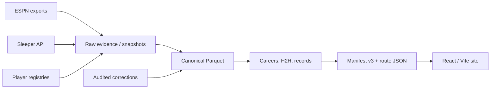

# Tatnall Legacy

Tatnall Legacy is the permanent historical record, statistical database, and
current-season command center for an eight-team fantasy football league founded
in 2015.

The site combines a canonical league archive with a live Sleeper-era dashboard:

- accepted champions, finalists, playoff seeds, standings, and matchup history;
- stable owner, franchise, team-season, matchup, and player identities;
- current Sleeper league metadata, users, rosters, keepers, drafts, matchups, and transactions;
- precomputed owner careers, rivalries, records, search, and data-health reporting;
- player profiles backed by league and NFL statistics;
- explicit coverage states for `complete`, `partial`, `unavailable`, `unknown`,
  and `not_applicable` data.

Raw provider data is never edited to make history look correct. League rulings,
including the 2022 championship awarded to King of January / Conner Malley, live
in audited correction files and are applied during normalization.

## Architecture



The layers have distinct jobs:

- `data/raw/`: immutable or refreshable provider evidence;
- `data/config/`: league, owner, franchise, and scoring configuration;
- `data/corrections/`: documented league rulings and identity overrides;
- `data/normalized/`: canonical Parquet tables—the source of league truth;
- `data/derived/`: verification and audit reports;
- `public/data/`: compact browser-delivery datasets;
- `src/`: React application and compatibility routes.

The legacy v2 manifest remains available during migration. New archive pages use
`public/data/manifest.v3.json` and domain-oriented resources under `now/`,
`history/`, `seasons/`, `owners/`, `players/`, `records/`, and `integrity/`.
The finalized 2025 facts are split into week-sized lineup and transaction files
plus a dedicated auction board, so the complete archive remains fast to browse.

## Local setup

Requirements: Node 20+, Python 3.11+, and Git LFS for the optional historical
player-stat repository.

```bash
npm ci
python3 -m venv .venv
.venv/bin/pip install -r requirements-data.txt
npm run dev
```

The Vite application is served under `/TatnallLegacy/`, matching GitHub Pages.

## Data pipeline

The complete current-data pipeline is:

```bash
PATH="$PWD/.venv/bin:$PATH" npm run data:refresh
```

Granular stages are available for development:

```bash
npm run data:ingest     # official Sleeper league + active player snapshots
npm run data:normalize  # canonical history and identity Parquet tables
npm run data:derive     # invariant checks used by derived datasets
npm run data:publish    # route-sized manifest v3 JSON
npm run data:validate   # canonical, public v3, and compatibility validators
```

`npm run build:data` is intentionally preserved for the older weekly player-data
pipeline until all player-detail routes migrate to v3.

### Historical data repository

Large ESPN/player-stat exports can live outside this repository and be linked as
`data_raw/`. The canonical league history itself is reproducible from the compact
season files under `data/`; missing large exports do not erase championship or
owner history.

## Corrections and provenance

Every correction includes an ID, target, field, reason, source note, and date.
The normalizer records both the previous and accepted values in
`data/derived/corrections_applied.json`. Add new rulings under `data/corrections/`
instead of editing raw exports or adding conditionals to React.

The public Data Health page exposes:

- season-by-season coverage;
- applied corrections;
- critical failures and warnings;
- quarantined ambiguous player IDs;
- unresolved commissioner questions.

## Testing and validation

```bash
npm test -- --runInBand
PATH="$PWD/.venv/bin:$PATH" npm run test:data
PATH="$PWD/.venv/bin:$PATH" npm run data:validate
npm run build
```

Critical invariants include exactly one champion per completed season, valid
foreign keys, no duplicate canonical IDs, winner/score agreement unless audited,
the permanent 2022 result and seeds, distinct Lamar Jackson QB/CB identities,
136 final 2025 team-week lineups, 551 completed 2025 transactions, 152 auction
purchases, and complete manifest v3 resources.

## Current-season refresh and deployment

`.github/workflows/pages.yml` runs on pushes to `main`, every four hours, or by
manual dispatch. It refreshes public Sleeper data, normalizes, publishes,
validates, tests, builds the GitHub Pages bundle, and stops deployment on critical
failure.

Sleeper's public read-only API requires no secret. Private historical ESPN
refreshes remain a local/manual process unless appropriate repository secrets are
configured; cookies and credentials must never be committed.

## Known limitations

- ESPN-era scoring settings still need commissioner verification before custom
  historical NFL points or value metrics are recalculated.
- 2015–2017 lineup and transaction exports are unavailable.
- Several later transaction exports are partial.
- The 2022 matchup export remains partial, so it is excluded from generated
  matchup records and head-to-head totals.
- The completed 2025 Sleeper snapshot is canonical for matchups, lineups,
  transactions, the auction draft, and Carl Marvin's third-place finish.
- The 2026 draft order has not yet been published by Sleeper. All 16 submitted
  keepers and the scheduled auction details are available without inventing an order.
- Existing player-detail pages still use compatibility datasets while the
  player-centric v3 profile publisher is completed.

See [the baseline](docs/v2-baseline.md), [open data questions](docs/data-questions.md),
and [corrections guide](data/corrections/README.md) for deeper detail.
